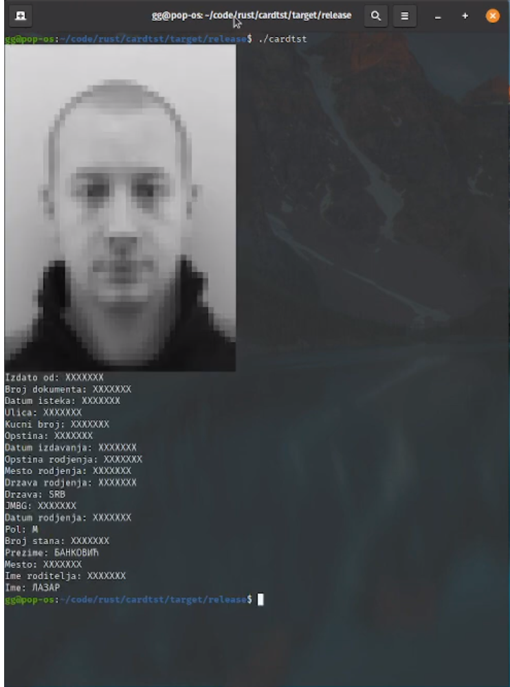

# SerbianIdReader

This is a simple Linux terminal application for reading data from serbian identity cards.  
Reading is done using only pcsc, pkcs#11 is not supported. 
Sixel is supported, terminals supporting sixel will show hiher quality images.  
[Demo on youtube](https://bit.ly/3jqs81x)  
<p align="center">
  
</p>

## Building  
```
cargo build --release
```
  
## Usage
```
$ ./rsid_reader --help

rsid_reader 0.1.0
Serbian IDCard reader

USAGE:
    rsid_reader [OPTIONS]

OPTIONS:
    -h, --help              Print help information
    -j, --to-json <PATH>    Dump to JSON to dir path
    -o, --to-json-stdout    Dump to JSON to stdout
    -p, --to-pdf <PATH>     Dump to pdf on path
    -V, --version           Print version information

```
